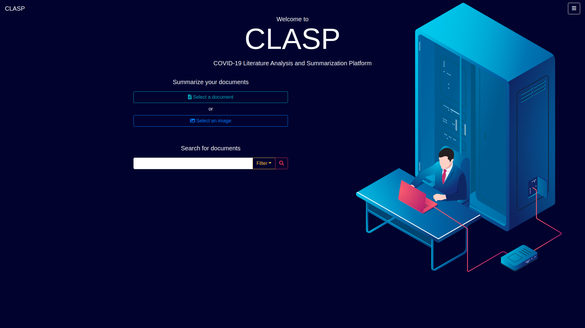
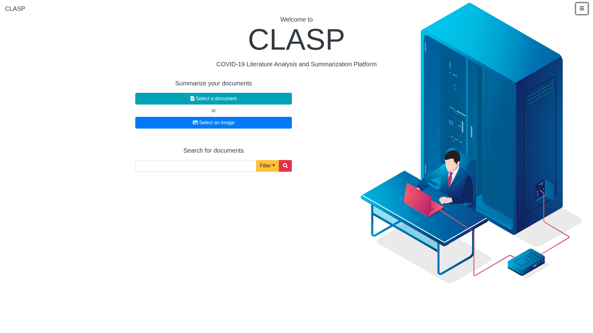
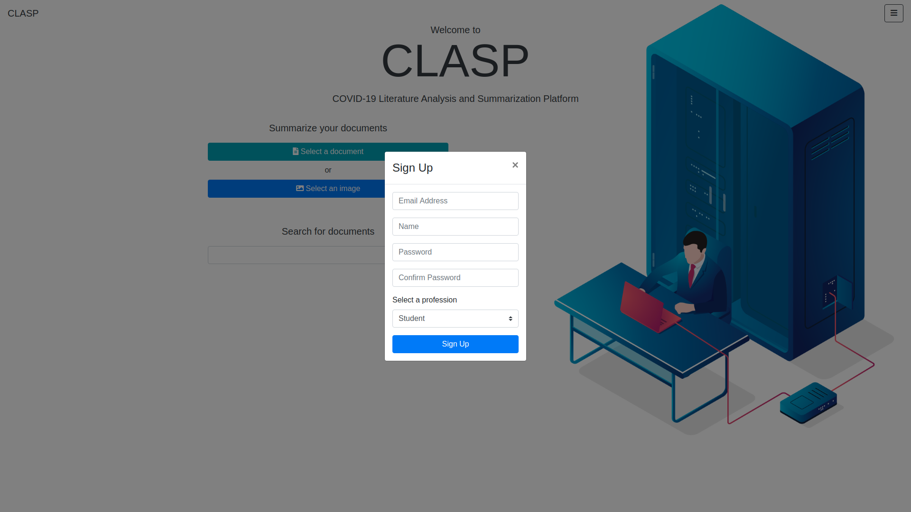
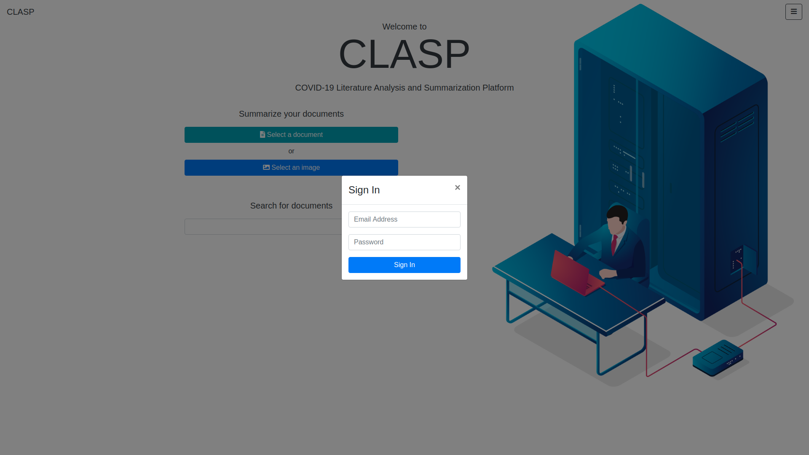
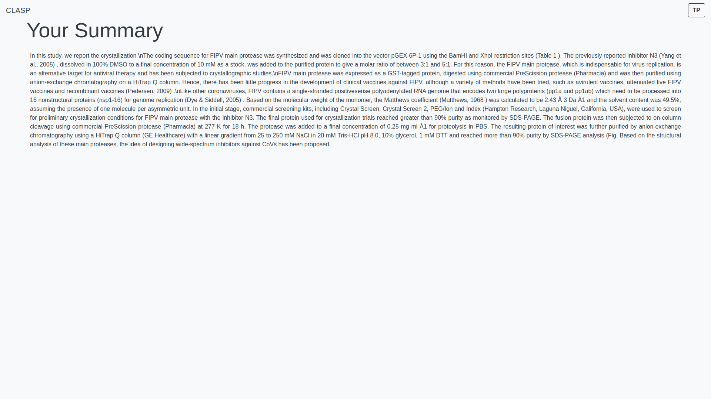
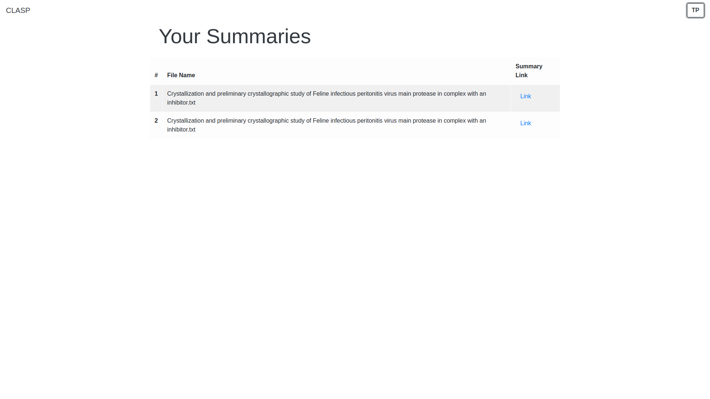
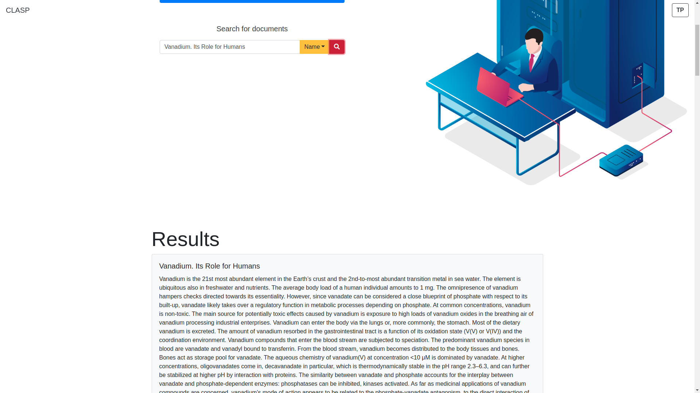
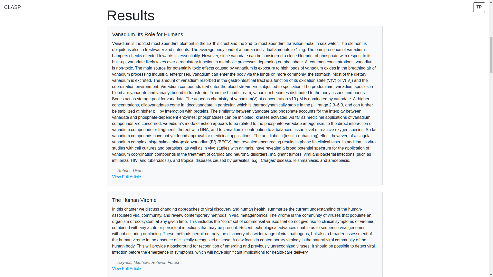
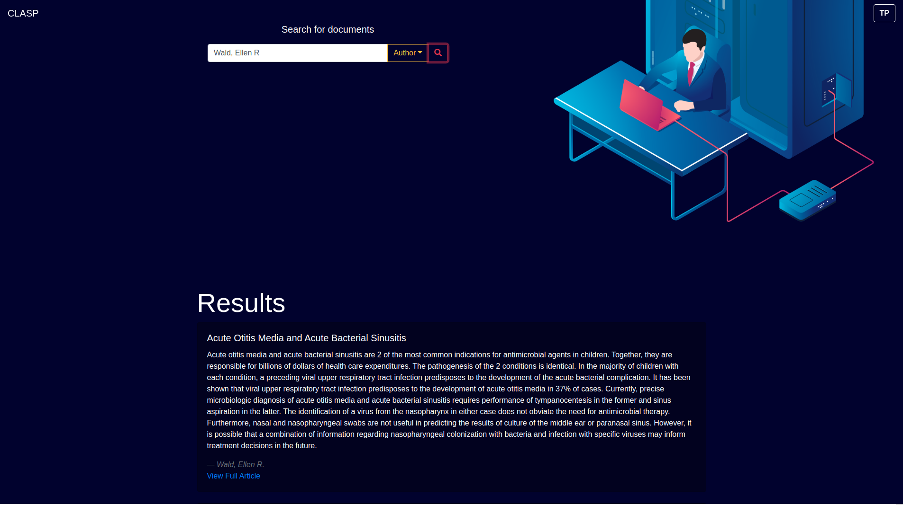
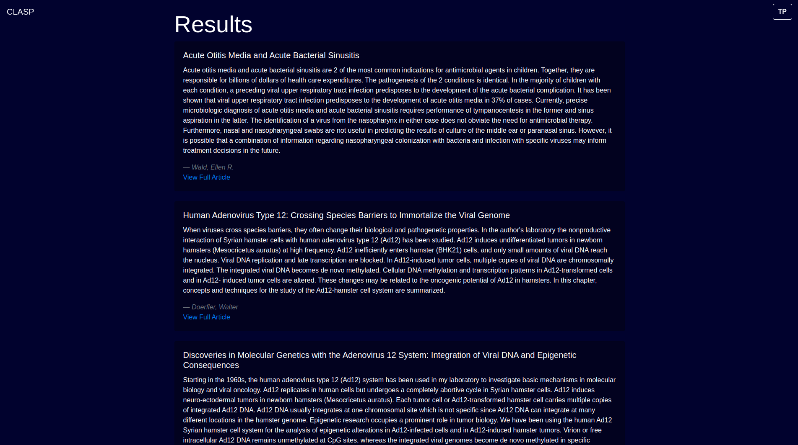

# CDAC Hackathon
## COVID-19 LITERATURE ANALYSIS AND SUMMARIZATION PLATFORM

#### [Use this link to access the google drive which contains our dataset and word embeddings](https://drive.google.com/drive/folders/1nKAo8oWqPuq39ky15duuhpt3sWEhyV-7)

#### [Click here to download the video for summariser](https://github.com/tanmaypardeshi/CDAC-Hackathon/blob/master/screenshots/CDAC_Prototype.mp4)

#### [Click here to download the video for information retrieval using title]()

#### [Click here to download the video for information retrieval using author]()

#### [Click here to open the text file used in the video recording](https://github.com/tanmaypardeshi/CDAC-Hackathon/blob/master/data/Crystallization%20and%20preliminary%20crystallographic%20study%20of%20Feline%20infectious%20peritonitis%20virus%20main%20protease%20in%20complex%20with%20an%20inhibitor.txt)

### Steps to run the project:

* **Requirements:**<br>
  1. python: version 3.8.x
  2. npm: version 6.14.x
  3. node: version 12.16.x
  4. pip and pipenv
 
* **Steps:**
  1. Clone the repository using<br> **git clone https://github.com/tanmaypardeshi/CDAC-Hackathon.git**
  2. Download the **glove** folder from the google drive link provided above and save it in the project directory.
  3. Download all the other csv and json files and store it in the **data** folder of the project.
  3. Use command **pipenv shell** to activate pipenv.
  4. For the first time, use **pipenv install** to install all dependencies<br>
  This will only be for the first time to install the packages.
  5. Navigate to the frontend folder and run **npm i** for the first time to install all javascript dependencies for React.
  6. To run the flask server use **python run.py** in the main project directory.
  7. Navigate to the frontend folder and run **npm start** to start development server and use the platform while keeping 
  the flask server running as well
 
  
### Documentation about the files in the repository
#### (Click on the links to open the folder)

**1. [Covid_Data.json:](https://drive.google.com/drive/folders/1nKAo8oWqPuq39ky15duuhpt3sWEhyV-7)** Dataset in the json format.<br> 

Follow the following steps to open the file:

```
import json
f=open ('Covid_Data.json') 
data = json.load(f)
print(data)
```

**2. [Data_Covid.csv:](https://drive.google.com/drive/folders/1nKAo8oWqPuq39ky15duuhpt3sWEhyV-7)** Dataset created by using Kaggle open Research data.<br> 

Follow the following steps to open the file:

```
import pandas as pd
data=pd.read_csv('Data_Covid.csv') 
print(data)
```

**3. [glove:](https://drive.google.com/drive/folders/1nKAo8oWqPuq39ky15duuhpt3sWEhyV-7)** Embeddings used to perform text summarization

**4. [data_script.ipynb:](data/data_script.ipynb)** The script written in order to extract data from the source data in the required format

**5. [Summariser.py:](https://github.com/tanmaypardeshi/CDAC-Hackathon/blob/master/Summariser.py)** Makes use of the TextRank algorithm to summarize the input Biomedical Text.

**6. [Info_Retrieval_Author_Fuzzy.py:](https://github.com/tanmaypardeshi/CDAC-Hackathon/blob/master/Info_Retrieval_Author_Fuzzy.py)** Makes use of levenshtein distance to generate a similarity score between the author based query and documents

**7. [Info_Retrieval_Title_Fuzzy.py:](https://github.com/tanmaypardeshi/CDAC-Hackathon/blob/master/Info_Retrieval_Title_Fuzzy.py)** Makes use of levenshtein distance to generate a similarity score between the title based query and documents 

**9. [Info_Retrieval_Data.csv:](https://drive.google.com/drive/folders/1nKAo8oWqPuq39ky15duuhpt3sWEhyV-7)** Dataset created by using Kaggle open Research data.


### Research papers referred while working for the TextRank algorithm:
#### (Click on the links to open the research paper)

* [Unsupervised Text Summarization Using Sentence Embeddings](https://www.cs.utexas.edu/~asaran/reports/summarization.pdf):

  This research paper explains the process of text summarization using unsupervised methods. It is done by clustering           sentence embeddings trained to embed paraphrases near each other. 
  
* [Application and analysis of text summarization for biomedical domain content](http://cs229.stanford.edu/proj2019spr/report/77.pdf):
    
    In this research paper, the approach is to implement and analyse abstractive and extractive text summarization machine learning models forgeneral language as well as biomedical domain-specific text. For abstractive text summarization, a sequence-to-sequence model that utilizes recurrent neural networks (RNNs) for biomedical text summarization. For
extractive text summarization, a pretrained BERT model is used.
    
* [Supervised Machine Learning for Extractive Query Based Summarisation of Biomedical Data](https://www.aclweb.org/anthology/W18-5604.pdf):

  This paper explores the impact of several supervised machine learning approaches for extracting multi-document summaries      for given queries. It compares classification and regression approaches for query-based extractive summarisation using        data provided by the BioASQ Challenge.
  
* [Information Retrieval as Statistical Translation](https://www.cse.iitb.ac.in/~soumen/readings/papers/BergerL1999xlate.pdf):

  This paper proposes a new probabilistic approach to information retrieval based upon the ideas of statistical machine         translation. The main approach is a statistical model on how a document can be translated into a query.
  
 * [Statistical Language Modeling For Information Retrieval](http://ciir.cs.umass.edu/pubfiles/ir-318.pdf)
  
    This paper reviews research and applications in statistical language modelling for information retrieval (IR) that has        emerged within the past several years as a new probabilistic framework for describing information retrieval processes.

* [Unsupervised Question Answering by Cloze Translation](https://research.fb.com/wp-content/uploads/2019/07/Unsupervised-Question-Answering-by-Cloze-Translation.pdf)

  This research paper explores to what extent high quality training data is actually required for Extractive QA, and investigates the possibility of unsupervised Extractive QA. This problem is approached by first learning to generate context, question and answer triplets in an unsupervised manner, which we then use to synthesize Extractive QA training data automatically.


### Snippets of the platform:

* ### Home page

<p float="left">
    
    
</p>

* ### Login and Signup

<p float="left">
    
    
</p>

* ### Summarization and My Summaries

<p float="left">
    
    
    
</p>

* ### Information Retrieval by Title

<p float="left">
    
    
</p>

* ### Information Retrieval by Author Name

<p float="left">
    
    
</p>

