# CDAC Hackathon
## COVID-19 LITERATURE ANALYSIS AND SUMMARIZATION PLATFORM

#### [Use this link to access the google drive which contains our dataset,word embeddings, PPT for the project and the sample videos](https://drive.google.com/drive/folders/1nKAo8oWqPuq39ky15duuhpt3sWEhyV-7)

#### [Click here to open the text file used in the video recording](https://github.com/tanmaypardeshi/CDAC-Hackathon/tree/master/data)

#### [Click here to access the videos](https://github.com/tanmaypardeshi/CDAC-Hackathon/blob/master/videos)

#### [Click here for the PPT for round 1](https://github.com/tanmaypardeshi/CDAC-Hackathon/blob/master/PPT%20Round%201.pdf)

#### [Click here for the PPT for round 2](https://github.com/tanmaypardeshi/CDAC-Hackathon/blob/master/PPT%20Round%202.pdf)

#### [Click here for the final documentation of round 2](https://github.com/tanmaypardeshi/CDAC-Hackathon/blob/master/Documentation%20Round%202.pdf)

### Steps to run the project:

* **Requirements:** 
  1. python: version 3.8.x
  2. yarn: version 1.22.x
  3. node: version 12.16.x
  4. pip and virtualenv.

 
* **Steps:**
  1. Clone the repository using  **git clone https://github.com/tanmaypardeshi/CDAC-Hackathon.git**
  2. Download the **glove** folder from the google drive link provided above and save it in the project directory.
  3. Download all the other csv and json files from the google drive link and store it in the **data** folder of the project directory.
  4. Use command **virtualenv venv** in project directory to create virtualenv.
  5. Use **source venv/bin/activate** to activate virtualenv.
  6. For the first time, use **pip install -r requirements.txt** in project directory to install all dependencies 
  This will only be for the first time to install the packages.
  7. Navigate to the frontend folder and run **yarn install** for the first time to install all javascript dependencies for React.
  8. To run the flask server use **python run.py** in the project directory.
  9. Navigate to the frontend folder and run **yarn start** to start development server and use the platform while keeping the flask server running as well.
  10. Use **deactivate** to deactivate virtualenv.  
  
 
### Documentation about the files in the repository
#### (Click on the links to open the folder)

**1. [glove:](https://drive.google.com/drive/folders/1nKAo8oWqPuq39ky15duuhpt3sWEhyV-7)** Embeddings used to perform text summarization and information retrieval for Real Time Research News.

**2. [summariser.py:](https://github.com/tanmaypardeshi/CDAC-Hackathon/blob/master/summariser.py)** Makes use of the TextRank algorithm to summarize the input Biomedical Text.

**3. [ir_author.py:](https://github.com/tanmaypardeshi/CDAC-Hackathon/blob/master/ir_author.py)** Makes use of levenshtein distance to generate a similarity score between the author based query and documents

**4. [ir_title.py:](https://github.com/tanmaypardeshi/CDAC-Hackathon/blob/master/ir_title.py)** Makes use of levenshtein distance and keyword indexing to generate a similarity score between the title based query and documents

**5. [ir_optimised.py:](https://github.com/tanmaypardeshi/CDAC-Hackathon/blob/master/ir_optimised.py)** Makes use of levenshtein distance and keyword indexing along with a keywords pickle file  to generate a similarity score between the author based query and documents

**6. [news.py:](https://github.com/tanmaypardeshi/CDAC-Hackathon/blob/master/news.py)** Makes use of scraping techniques to retrieve unstructured COVID-19 research news from the internet and makes use of info retrieval to display relevant results on the basis of a query.

**7. [Q&A_CDQA_Finetuning.py:](https://github.com/tanmaypardeshi/CDAC-Hackathon/blob/master/Q&A_CDQA_Finetuning.py)** The script written to fine-tune BERT with respect to a subset of CORD-19 dataset

**8. [Anomaly_detection.py:](https://github.com/tanmaypardeshi/CDAC-Hackathon/blob/master/Anomaly_detection.py)** The script written to fine-tune BERT with respect to a subset of CORD-19 dataset

**9 [qna.joblib](https://drive.google.com/drive/folders/1MAMWa5IZ9z2k_u2SpYXrVHLCoT5EMy3J)** Trained model which predicts answers on the basis of the question query

**10 [ir_old.csv](https://drive.google.com/drive/folders/1MAMWa5IZ9z2k_u2SpYXrVHLCoT5EMy3J)** Dataset created by using CORD-19 data for Information Retrieval

### Research papers referred while working for the project:
#### (Click on the links to open the research paper)

* [Unsupervised Text Summarization Using Sentence Embeddings](https://www.cs.utexas.edu/~asaran/reports/summarization.pdf):

  This research paper explains the process of text summarization using unsupervised methods. It is done by clustering sentence embeddings trained to embed paraphrases near each other. 
  
* [Application and analysis of text summarization for biomedical domain content](http://cs229.stanford.edu/proj2019spr/report/77.pdf):
    
    In this research paper, the approach is to implement and analyse abstractive and extractive text summarization machine learning models forgeneral language as well as biomedical domain-specific text. For abstractive text summarization, a sequence-to-sequence model that utilizes recurrent neural networks (RNNs) for biomedical text summarization. For
extractive text summarization, a pretrained BERT model is used.
    
* [Supervised Machine Learning for Extractive Query Based Summarisation of Biomedical Data](https://www.aclweb.org/anthology/W18-5604.pdf):

  This paper explores the impact of several supervised machine learning approaches for extracting multi-document summaries for given queries. It compares classification and regression approaches for query-based extractive summarisation using data provided by the BioASQ Challenge.
  
* [Information Retrieval as Statistical Translation](https://www.cse.iitb.ac.in/~soumen/readings/papers/BergerL1999xlate.pdf):

  This paper proposes a new probabilistic approach to information retrieval based upon the ideas of statistical machine translation. The main approach is a statistical model on how a document can be translated into a query.
  
 * [Statistical Language Modeling For Information Retrieval](http://ciir.cs.umass.edu/pubfiles/ir-318.pdf)
  
    This paper reviews research and applications in statistical language modelling for information retrieval (IR) that has emerged within the past several years as a new probabilistic framework for describing information retrieval processes.

* [Unsupervised Question Answering by Cloze Translation](https://research.fb.com/wp-content/uploads/2019/07/Unsupervised-Question-Answering-by-Cloze-Translation.pdf)

  This research paper explores to what extent high quality training data is actually required for Extractive QA, and investigates the possibility of unsupervised Extractive QA. This problem is approached by first learning to generate context, question and answer triplets in an unsupervised manner, which we then use to synthesize Extractive QA training data automatically.

* [A review on anomaly detection in disease outbreak detection](https://www.researchgate.net/publication/281465876_A_review_on_anomaly_detection_in_disease_outbreak_detection)

   Gives a brief description about detection of pandemic like anomalies using AI

* [BERT: Pre-training of Deep Bidirectional Transformers for Language Understanding](https://arxiv.org/abs/1810.04805)

  The paper explores the architecture of the current State Of The Art Language Representation Model - BERT

### Snippets of the platform:

* ### Welcome modal

    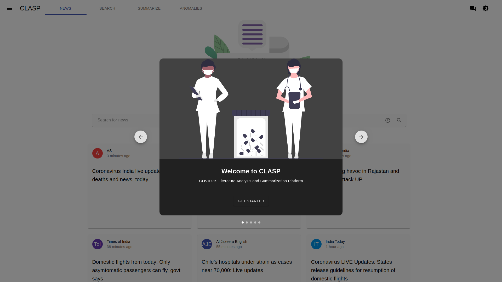
    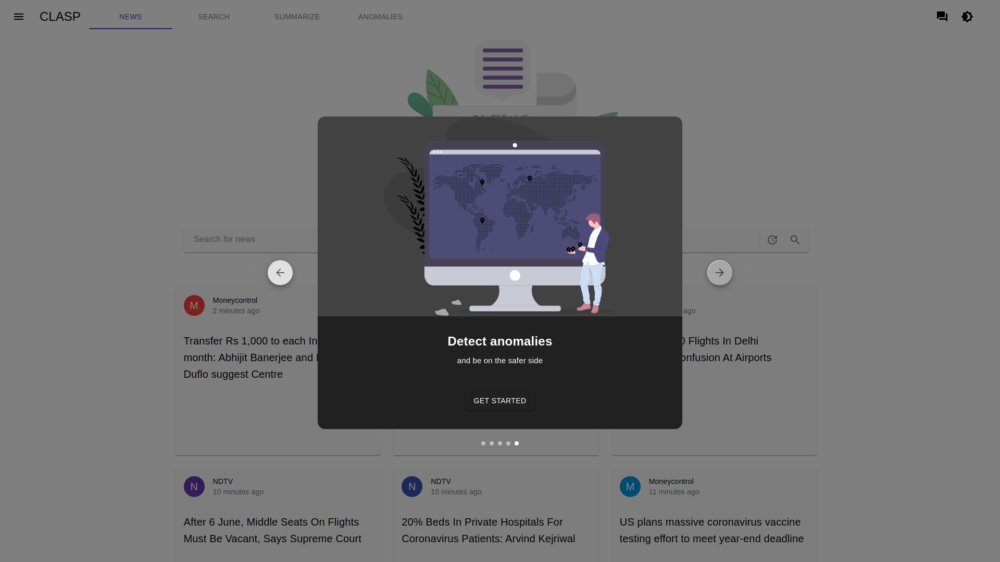

## News

    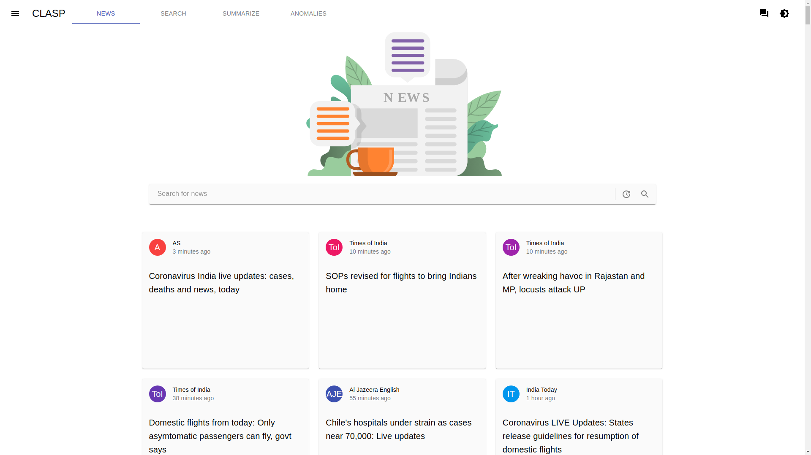
    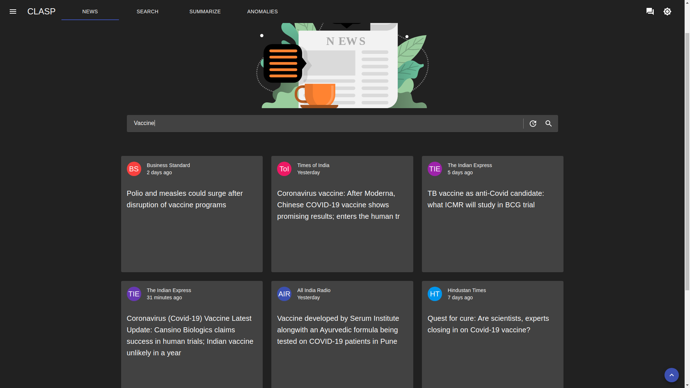

## Login and Signup

    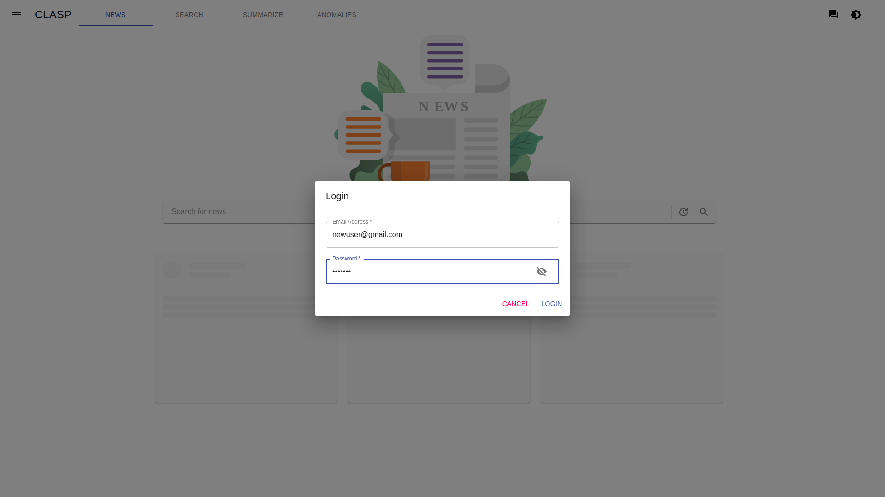
    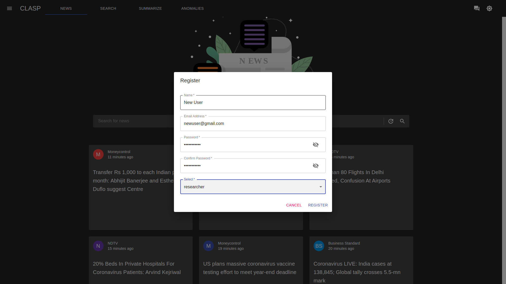

* ### Summarization and My Summaries

    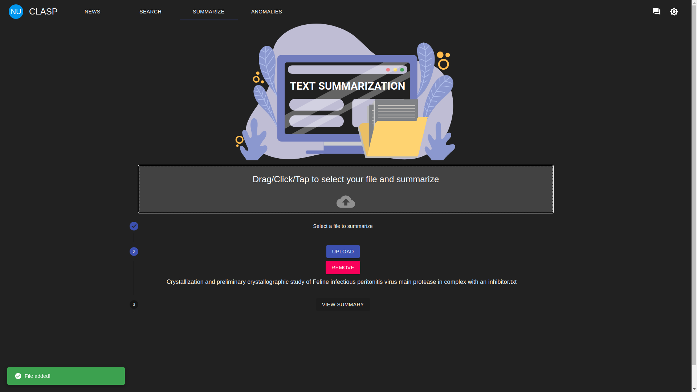
    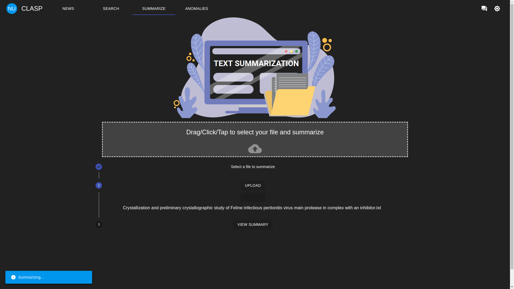
    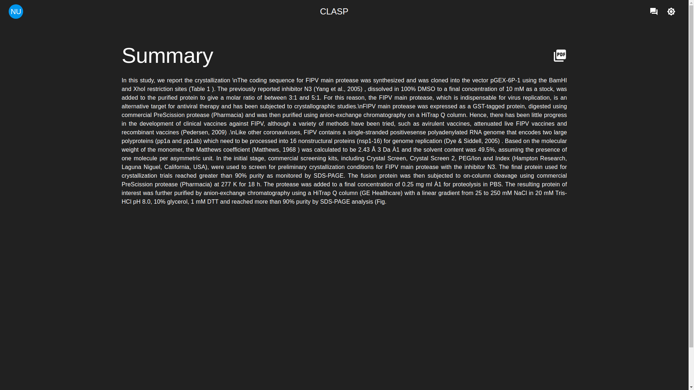
    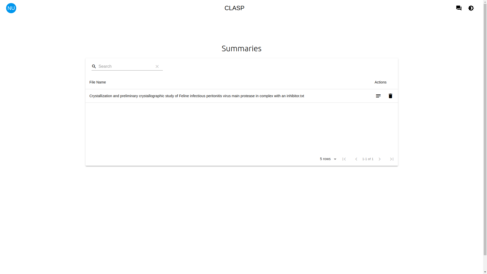

* ### Information Retrieval and My Bookmarks

    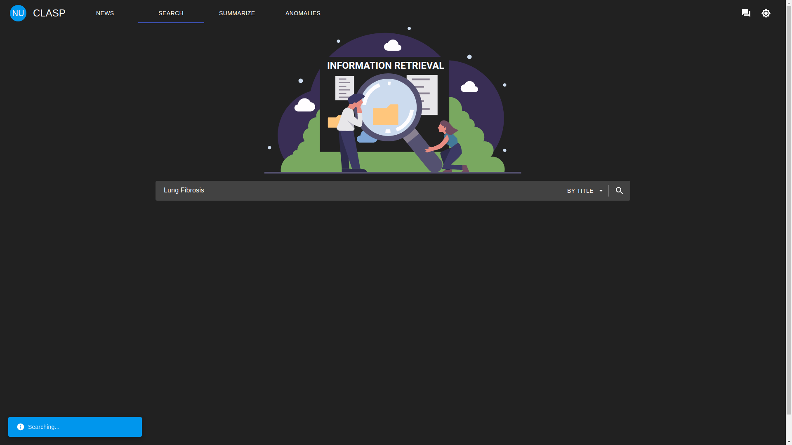
    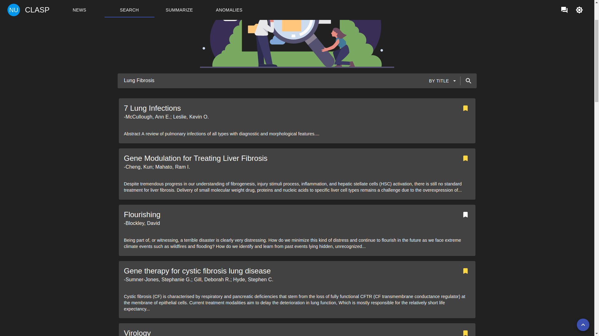
    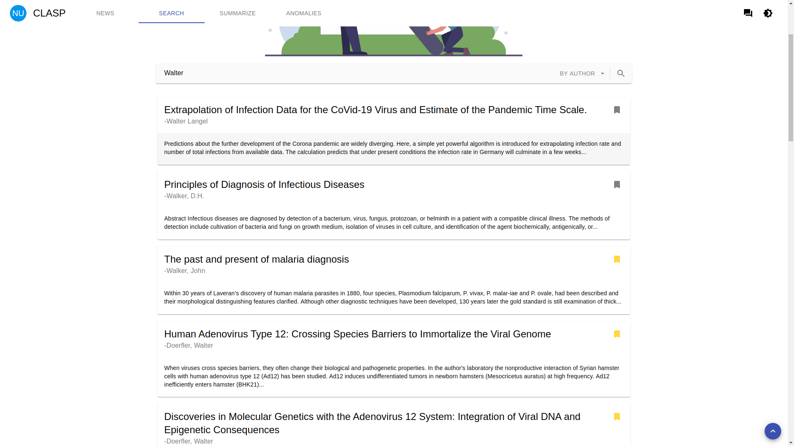
    

* ### Q & A and My Questions

    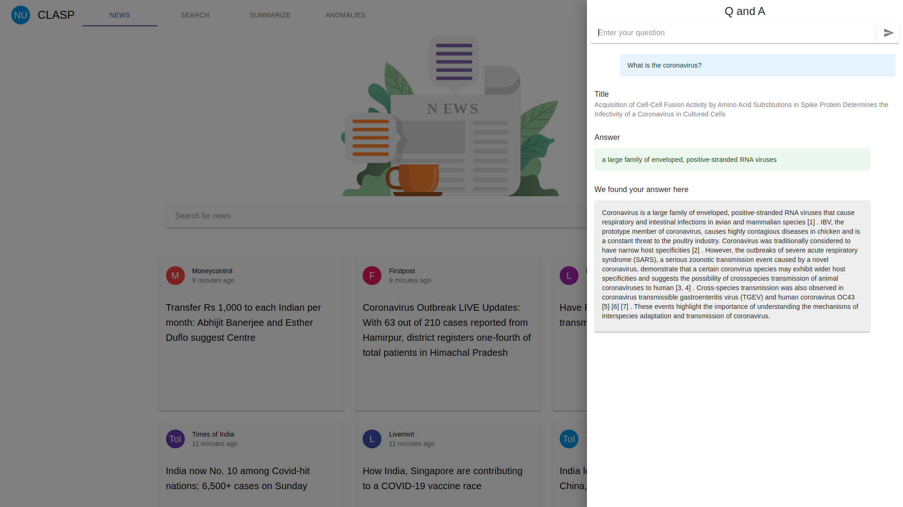
    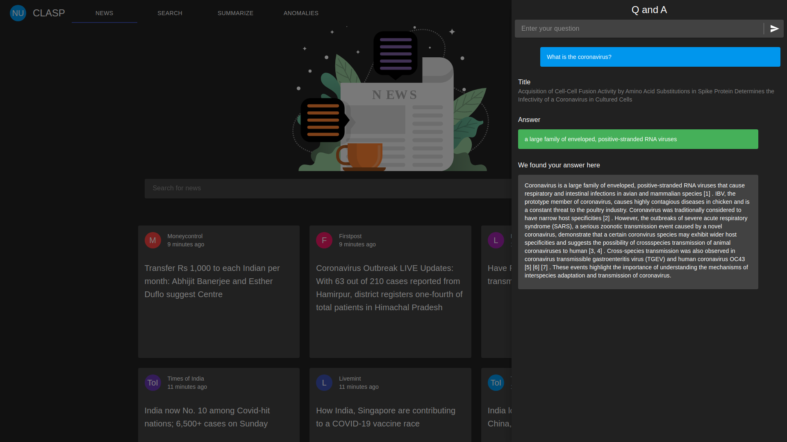
    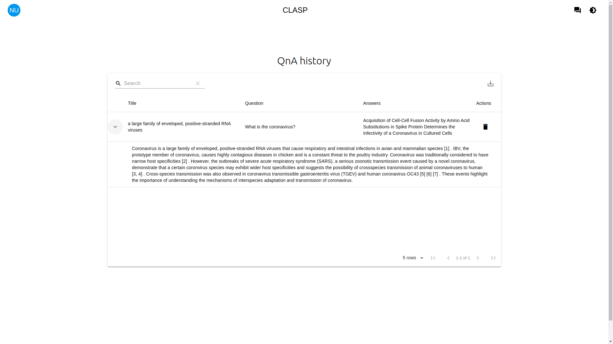

* ### Anomaly Detection Map

    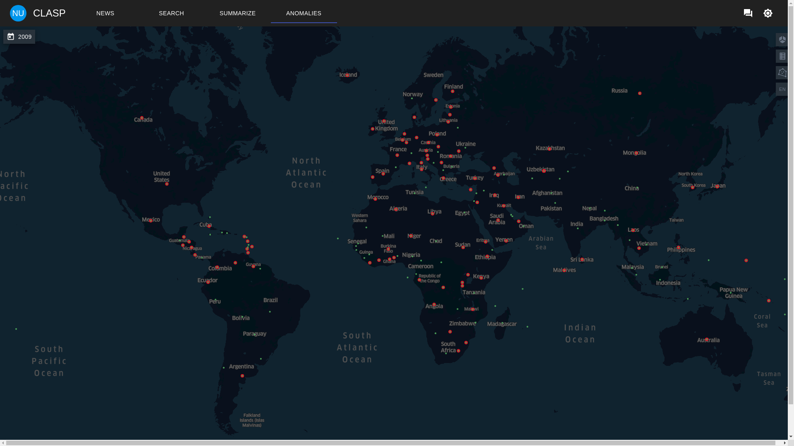
    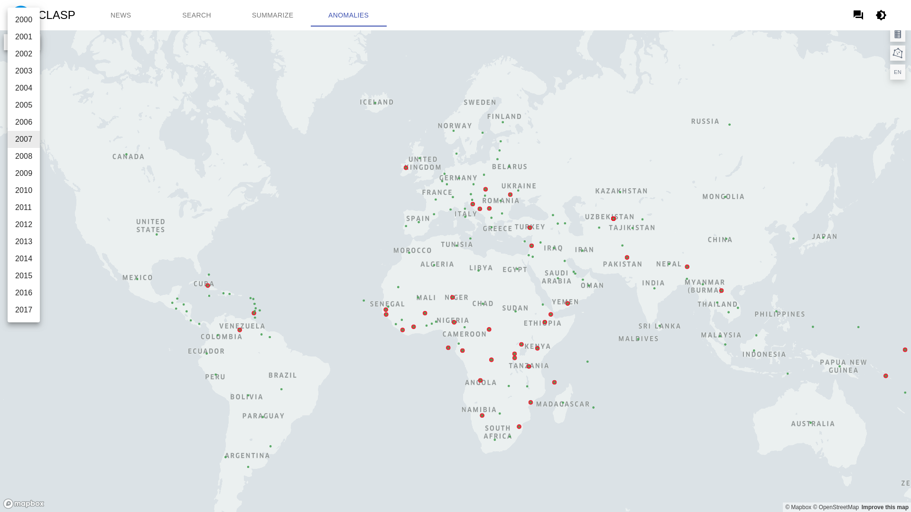

